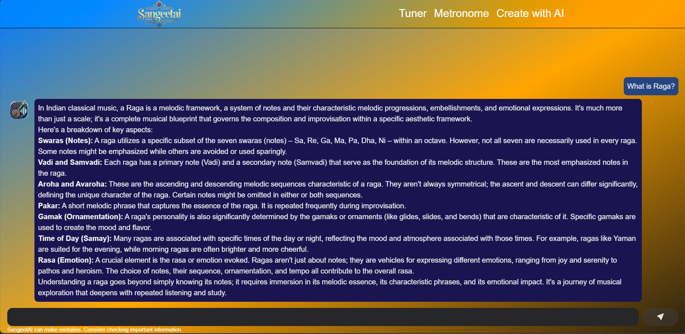

# SangeetAI
Your AI-Powered Guide to Indian Classical Music.

Made for the 2025 Google Solution Challenge.

Version: 1.0.0

Link to SangeetAI: [here](https://sangeetai-xi.vercel.app)

GitHub Repository: [here](https://github.com/AaryanKhClasses/SangeetAI)

Link to YouTube Video: [here](https://youtu.be/6zbYdPkekaY)

## Problem Statement:
### Library & Tool for analysis & synthesis of Indian Classical Music
This uses a neural & symbolic processing to analyze and synthesize Indian Classical music. Certain parts are done in traditional speech processing for recognition and analysis of audio signals. Some of them are done using symbolic processing for generating & synthesizing notes. Finally some neural (transformer/latent diffusion based models) for parsing and synthesizing audio.

**Objective:** This use case addresses the problem of analysis and synthesis of Indian Classical Music. The AI-based solution uses a combination of neural and symbolic processing to analyze and synthesize Indian Classical music. Certain parts are done in traditional speech processing for recognition and analysis of audio signals. Some of them are done using symbolic processing for generating & synthesizing notes. Finally some neural (transformer/latent diffusion based models) for parsing and synthesizing audio.

## Introduction:
### Authors:
1. [Aaryan Khedekar](https://github.com/AaryanKhClasses)
2. [Krish Acharya](https://github.com/krish-acharya14)
3. [Kartikey Tiwari](https://github.com/kartikeyy12)
4. [Eashan Morajkar](https://github.com/eashan-em)

### Overview:
**SangeetAI** is a web application built with Next.JS that provides an AI-powered assistant to explore the world of Indian Classical Music. It offers a chatbot powered by Google Gemini, a tuner, and a metronome, creating a comprehensive learning and practice environment for musicians and enthusiasts. This application was developed using Google's Project IDX, enabling efficient coding and collaboration.

### Technologies Used:
1. **Next.js:** React framework for building performant and scalable web applications.
2. **React:** JavaScript library for building user interfaces.
3. **Tailwind CSS:** Utility-first CSS framework for rapid UI development.
4. **HeroUI:** Set of pre-designed UI components for a polished look and feel.
5. **Google Gemini (Generative AI):** Powers the AI chatbot functionality.
6. **Google Project IDX:** Cloud-based development environment.

### Key Features:
1. **AI-Powered Chatbot:** Utilizing Google Gemini, SangeetAI can answer questions about Indian Classical Music theory, history, concepts (Raag, Taal, etc.), and famous musicians.
2. **Built-in Tuner:** A precise tuner helps you tune your instruments accurately for optimal performance.
3. **Versatile Metronome:** A customizable metronome assists in practicing with perfect timing and rhythm.
4. **User-Friendly Interface:** Built with Next.JS and styled with Tailwind CSS and HeroUI components for an intuitive and visually appealing experience.
5. **Google Project IDX Development:** Developed using Google's Project IDX for streamlined coding, collaboration, and deployment.

## Using The Chatbot:
The AI chatbot is your primary source for information about Indian Classical Music.
1.  **Access:** The chatbot interface is located on the main page of the application. Also you can click [here](https://sangeetai-xi.vercel.app/create-music) to directly go to the chatbot page.
2. **Asking Questions:** Type your questions in the input field and press Enter or click the "Send" button. Some Example Questions are provided on the page itself.
3. **Response Time:** The chatbot's response time may vary depending on the complexity of the query and the current load on the Google Gemini API.
4. **Limitations:** While Gemini is powerful, it's essential to remember that it's an AI model. Verify information from multiple sources, especially for critical or scholarly research. 

> [!WARNING]
> Gemini API only supports limited number of requests per minute & day. It is also important to know about the quotas.

A preview of the chatbot feature can be seen here:

## Using the Other Features:
### The Metronome:
The Metronome provides a rhythmic pulse to help you practice.
1.  **Access:** Navigate to the "Metronome" section of the application. Also, you can click [here](https://sangeetai-xi.vercel.app/metronome) to directly visit the page.
2. **Tempo (BPM):** Adjust the tempo (beats per minute) using the slider or by clicking the increase / decrease temp buttons.
3. **Start/Stop:** Click the "Start" button to begin the metronome, and the "Stop" button to halt it.
4. **Future Plans:** Include time signature control and visual cues.

### The Tuner:
The Tuner helps you accurately tune your instruments.
1. **Access:** Navigate to the "Tuner" section of the application. Also, you can click [here](https://sangeetai-xi.vercel.app/tuner) to directly visit the page.
2. **Usage:** Just click the "Start" button and it will display the current pitch, clarity and the note played.
3. **Limitations:** It is not very accurate.

> [!WARNING]
> The microphone permission must be enabled for this feature to work as the WebAudio API  is used to detect the tune.

## Future of the Project:
### Current Plans:
This was initially a repository just made for the Google Solution Challenge 2025; however we are looking forward into maintaining this project for some time, which includes addition of many more features and bug fixes which were not possible during the initial hackathon period.
1. **Improve the overall UI of the application:** The UI of SangeetAI can be improved with a unique title font, subtle Indian-themed visuals, and better mobile responsiveness.
2. **Mobile version of the application:** Build dedicated mobile apps for on-the-go practice, offline access, and a more seamless user experience.
3. **Virtual Instruments Integration:** Add a digital tanpura, tabla, harmonium, or even a virtual synthesizer to simulate accompaniment during practice.
4. **Bugfix and Improvement of existing features:** Bugfix the tuner and add more features to the metronome like tap tempo and sound customizations.

### Contributing:
Once after the hackathon period finishes, if you're interested in contributing and maintaining the project, please feel free to do so. Follow the below steps to contribute:
1. **Fork the repository:** Create your own copy of the repository on GitHub.
2. **Create a branch:** Create a new branch for your feature or bug fix.
3. **Make your changes:** Implement your changes and ensure they are well-tested.
4. **Submit a pull request:** Submit a pull request to the main branch.

> [!NOTE]
> Please ensure your code follows the project's coding standards and includes appropriate documentation.

### Licensing:
The project is licensed under the GNU-GPLv3.0 License. You can check the license by going to the `LICENSE` file or click [here](./LICENSE)

### Contact:
Feel free to open an issue in order to contact in case of any feedback or questions.
